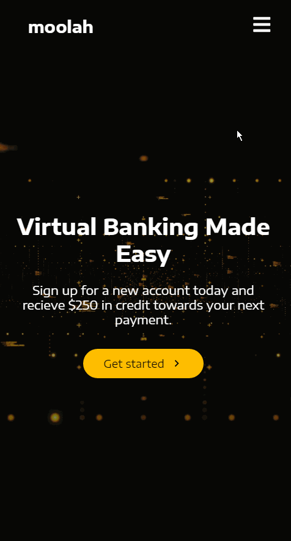

# moolah-react-app

**moolah-react-app** is a mock banking website similar to other banking sites. Has an About, Discover, Services, and Sign Up section. Uses styled-components and smooth scroll. 

Time spent: **22** days spent in total

## Purpose
The main purpose of the site is to practice building a React website using styled-components and utilizing npm react components like React Scroll which is used to animate vertical scrolling between the different sections of the page. So when the home logo is pressed it'll animatedly scroll to the very top of the page. If About, Discover, Services, and Sign Up is clicked on using the Navigation Bar it'll animatedly scroll to those sections of the page for ease of navigation and have a green underline to highlight to user which section of the page they are at. React-icons were used to get varying icons like the hamburger menu bars, icons for social media companies, arrows, etc. The majority of the buttons are animated when hovered by changing color, icon change, or changing size. The footer has typical service stuff at the bottom which only links to the sign-in page as it would have taken a lot of time to make those individual pages for all those varying services. The footer also has the moolah logo and the logo of different social media platforms when clicked just goes to that social media’s home page. When the sizing of the browser changes the website adjusts its size to fit the minimizing browser. When it gets small enough the navigation bar gets replaced with a hamburger menu bars icon so when it's clicked on a drop-down of the About, Discover, Services, and Sign Up section options comes up. When the Sign In button is pressed it takes you to the Sign In page where it asks the user for the email and password. The sign-in isn't functional it is just there as a mockup.

## Video Walkthrough

Here's a walkthrough of the moolah-react-app:

**Fullscreen Browser Window:**

**Minimized Browser Window:**

GIF created with [LiceCap](http://www.cockos.com/licecap/).

# Getting Started with Create React App

This project was bootstrapped with [Create React App](https://github.com/facebook/create-react-app).

## Resources
- react-icons (https://react-icons.github.io/react-icons/search?q=bars)
- npmjs.com (https://www.npmjs.com/package/react-scroll)
- Google Fonts (https://fonts.google.com/specimen/Encode+Sans+Expanded?query=encode+sans+exp)
- pexels.com (https://www.pexels.com/search/videos/data/)
- undraw.co (https://undraw.co/illustrations)

